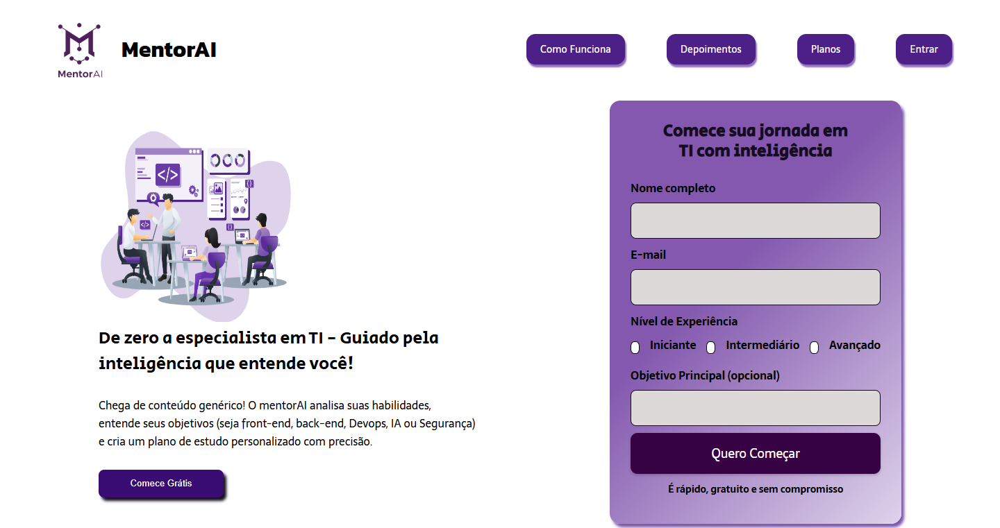

# MentorAI 🎓🤖  

**MentorAI** é uma plataforma pensada para **guiar iniciantes em programação e TI** em sua jornada de aprendizado.  
A ideia é oferecer um **mentor inteligente** que analisa seu nível de conhecimento, entende seus objetivos (Front-end, Back-end, DevOps, IA ou Segurança) e cria **um plano de estudo personalizado**.  

Este repositório contém a **Landing Page oficial** do MentorAI, desenvolvida para apresentar o conceito do projeto e permitir que novos usuários façam seu cadastro inicial.  

---

## ✨ Destaques da Landing Page

-  **Mensagem clara e inspiradora**: de zero a especialista em TI  
-  **Formulário interativo**: coleta nome, e-mail, nível de experiência e objetivo principal  
-  **Design moderno e responsivo**: inspirado em paleta roxa e branco, transmitindo tecnologia e confiança  
-  **Call-to-Action direto**: botão para começar grátis sem compromisso  
-  **Seções planejadas**: como funciona, depoimentos, planos e login  

## 🛠️ Tecnologias Utilizadas

- **HTML5**  
- **CSS3**  

## 📸 Preview

  
